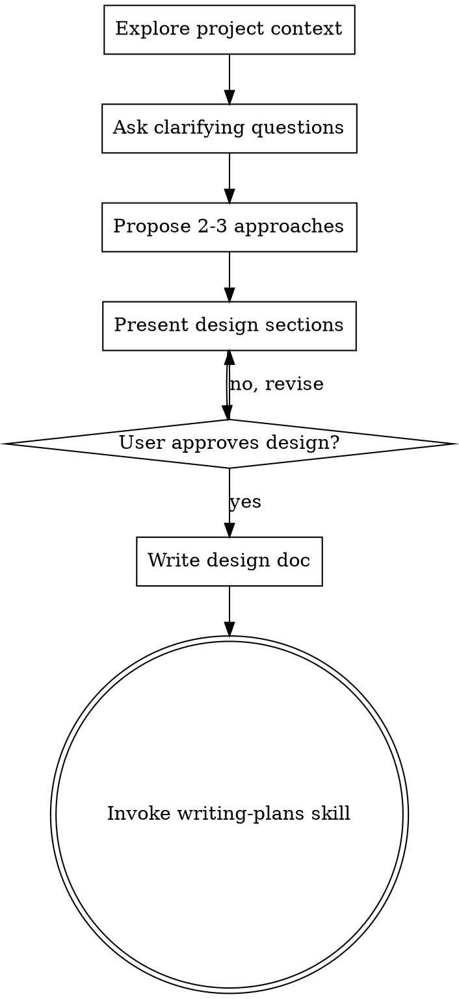

# 将头脑风暴的想法转化为设计

## 概要

通过自然、协作的对话，帮助将想法转化为完整的设计和规格。

首先了解当前项目上下文，然后一次询问一个问题以细化想法。一旦你理解要构建的内容，就提出设计并获取用户批准。

<HARD-GATE>
Do NOT invoke any implementation skill, write any code, scaffold any project, or take any implementation action until you have presented a design and the user has approved it. This applies to EVERY project regardless of perceived simplicity.
</HARD-GATE>

## 反模式： "This Is Too Simple To Need A Design"

每个项目都应经过此流程。一个待办事项列表、单一功能的实用工具、一个配置更改——所有这些都应如此。所谓“简单”的项目往往因为未被审视的假设而造成最多的浪费工作。设计可以很短（对真正简单的项目只需几句话），但你必须提出设计并获得批准。

## 清单

你必须为下列每一项创建任务并按顺序完成它们：

1. **探索项目上下文** — 检查文件、文档、最近的提交
2. **提出澄清性问题** — 每次一个问题，了解目的/约束/成功标准
3. **提出 2-3 种方法** — 列出权衡并给出你的推荐
4. **呈现设计** — 按复杂度分节呈现，且在每节后获取用户批准
5. **撰写设计文档** — 保存到 `docs/plans/YYYY-MM-DD-<topic>-design.md` 并提交
6. **过渡到实现** — 调用 writing-plans 技能以创建实施计划

## 流程图

**The terminal state is invoking writing-plans.** Do NOT invoke frontend-design, mcp-builder, or any other implementation skill. The ONLY skill you invoke after brainstorming is writing-plans.

## 该过程

**理解想法:**

- 先查看当前项目状态（文件、文档、最近的提交）
- 每次只问一个问题以细化想法
- 优先使用多项选择问题，但开放式问题也可以
- 每次消息只包含一个问题 — 如果某个主题需要更多探索，则分成多条问题
- 关注理解：目的、约束、成功标准

**探索方法:**

- 提出 2-3 种不同的方法并说明权衡
- 以对话方式呈现选项并给出你的推荐和理由
- 以你推荐的选项开头，并解释原因

**呈现设计:**

- 一旦你确信理解要构建的内容，就呈现设计
- 每个部分按其复杂度调整长度：如果直观明了则几句即可，复杂时可写 200-300 words
- 在每个部分之后询问是否看起来正确
- 覆盖：架构、组件、数据流、错误处理、测试
- 如果有不清楚的地方，准备返回并澄清

## 设计之后

**文档:**

- 将验证过的设计写入 `docs/plans/YYYY-MM-DD-<topic>-design.md`
- 如果可用，使用 elements-of-style:writing-clearly-and-concisely 技能
- 将设计文档提交到 git

**实现:**

- 调用 writing-plans 技能以创建详细的实施计划
- 不要调用任何其他技能。writing-plans 是下一步。

## 核心原则

- **One question at a time** - 不要一次性提出多个问题以免造成负担
- **Multiple choice preferred** - 优先使用多项选择问题，回答更容易
- **YAGNI ruthlessly** - 从所有设计中移除不必要的功能
- **Explore alternatives** - 在定稿前始终提出 2-3 种方案
- **Incremental validation** - 呈现设计并在继续前获取批准
- **Be flexible** - 当某些内容不清楚时，回去澄清
