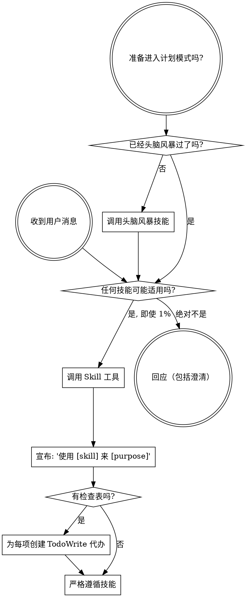

<EXTREMELY-IMPORTANT>
如果你认为即使有 1% 的概率某个技能可能适用于你正在做的事，你绝对必须调用该技能。

如果某个技能适用于你的任务，你没有选择的余地。你必须使用它。

这不是可以协商的。这不是可选的。你不能为自己找借口逃避这一点。
</EXTREMELY-IMPORTANT>

## How to Access Skills

**In Claude Code:** 使用 `Skill` 工具。当你调用技能时，其内容会被加载并呈现给你——请直接遵循它。切勿对技能文件使用 Read 工具。

**In other environments:** 查阅你平台的文档，了解技能如何被加载。

# Using Skills

## The Rule

**在任何回应或行动之前调用相关或被请求的技能。** 即使只有 1% 的概率某项技能适用，你也应调用该技能进行检查。如果被调用的技能对当前情形不合适，你无需使用它。

## Red Flags

这些想法意味着停止——你在为自己找借口：

| 想法                      | 现实                                         |
| ------------------------- | -------------------------------------------- |
| "这只是一个简单问题"      | 问题也是任务。检查技能。                     |
| "我需要先更多上下文"      | 技能检查应在澄清问题之前进行。               |
| "让我先探索代码库"        | 技能会告诉你如何探索。先检查技能。           |
| "我可以快速检查 git/文件" | 文件缺乏对话上下文。检查技能。               |
| "让我先收集信息"          | 技能会告诉你如何收集信息。                   |
| "这不需要正式技能"        | 如果存在技能，就使用它。                     |
| "我记得这个技能"          | 技能会演进。阅读当前版本。                   |
| "这不算是一个任务"        | 行动即为任务。检查技能。                     |
| "这个技能有点大材小用"    | 简单事情也可能复杂。使用技能。               |
| "我先只做这一件事"        | 在做任何事之前先检查。                       |
| "这感觉很有成效"          | 无纪律的行动会浪费时间。技能能防止这种情况。 |
| "我知道那是什么意思"      | 知道概念 ≠ 使用技能。调用它。                |

## Skill Priority

当多个技能可能适用时，使用以下顺序：

1. **先用流程类技能**（头脑风暴、调试）- 这些决定如何处理任务
2. **再用实现类技能**（frontend-design、mcp-builder）- 这些指导具体执行

"Let's build X" → 先头脑风暴，然后实现类技能。
"Fix this bug" → 先调试，然后领域特定技能。

## Skill Types

**刚性**（TDD、调试）：严格遵循。不要放松纪律。

**灵活**（模式类）：将原则适配于上下文。

技能本身会指示你采用哪种方式。

## User Instructions

指令说明做什么，不说明如何做。"添加 X" 或 "修复 Y" 并不意味着可以跳过工作流程。
